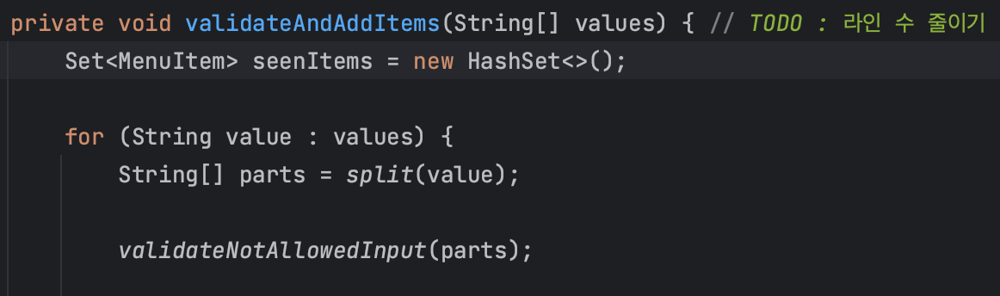
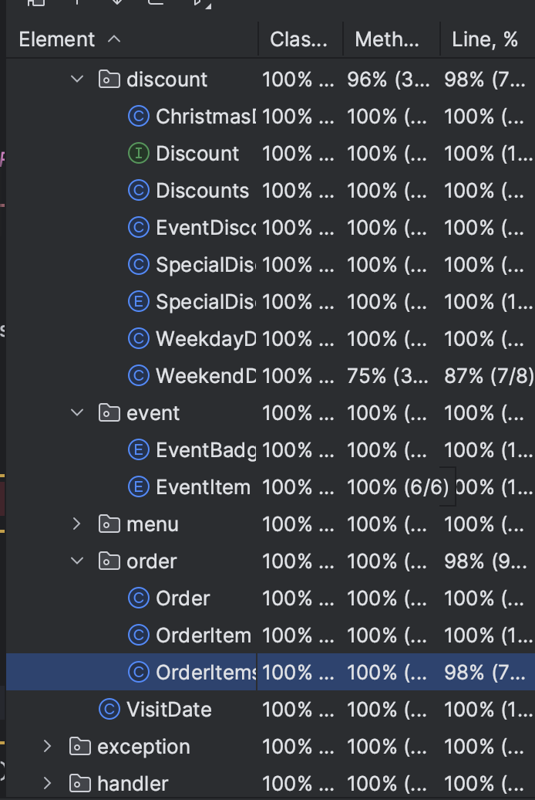
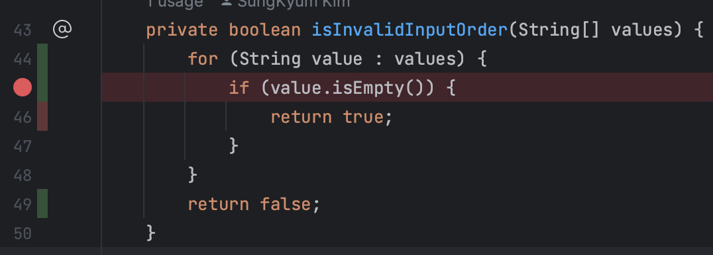
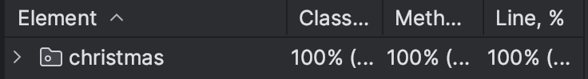

> *“이번 4주 차 미션에서는 3주 차 미션의 학습 목표인**클래스(객체)를 분리하는 연습**을 조금 더 살펴볼게요.*
>
>
> *… 특히, **클래스의 역할과 책임을 생각해 보고 클래스 작성 시 도메인 로직에 집중하는 방향**으로 구현하시고, UI는 도메인 로직과 분리하는 방향으로 생각했으면 좋겠어요 …”*
>

이번 주차는 클래스의 역할과 책임을 생각해보고 도메인 로직에 집중하는 방향성을 제시해주었습니다. 추가로 코수타에서 코치님이 제시해주셨던 ***“프로그램의 핵심을 한 줄로 정리해보고 핵심을 먼저 구현하는 것을
집중하라”***는 가이드를 참고하여 이번 과제 개발을 진행했습니다.

## 프로젝트를 진행하며

처음에는 기존과는 전혀 다른 방식의 과제 요구 사항에 적잖이 당황했습니다. 따라서 더욱 강조하신 프로젝트의 핵심을 명확하게 하는 것 부터 시작했습니다.

> 사용자로부터 식당 예상 방문 날짜와 주문 메뉴를 입력받아, 해당 날짜의 이벤트 혜택과 할인 정보를 계산하여 출력하는 우테코 식당 12월 이벤트 플래너.
>

한 줄 정리 후에는 이것으로 부터 명세서를 작성하기 시작하였습니다. 그리고 프로그램을 만들어가며 큰 줄기로 부터 뻗어나가며 기능 명세서를 완성했습니다.



효율적인 개발을 위해 핵심 기능을 먼저 완성하는데에 집중하였습니다. 지난 주와는 달리 개발과 함께 여유롭게 리팩토링을 진행할 수 없었기에 필요한 개선사항을 TODO 주석으로 남기어 리팩토링 단계에서 놓치지 않을 수
있도록 하였습니다.

완성 후에는 약 이틀 동안 리팩토링에 집중하는 시간을 가졌습니다. 무엇보다 집중하려 한 것은 클래스의 역할과 책임을 깊게 고민하고 코드를 재배치 하며 이전 과제들의 아쉬운 점들을 보완하려 노력했습니다.

## 리팩토링 여행기

### 분명한 역할 분배 - 일급 컬렉션 적용하기

```java
class OutputView {

    // ... 

    private static boolean hasNoDiscount(List<Discount> discounts, Order order) {
        boolean hasDiscount = discounts.stream()
                .anyMatch(discount -> discount.calculateDiscountAmount(order) > 0);
        return !hasDiscount;
    }

    // 해당 로직을 일급 컬렉션으로 분리하기
    class Discounts {

        // ...

        public boolean hasNoDiscount(Order order) {
            boolean hasDiscount = discounts.stream()
                    .anyMatch(discount -> discount.calculateDiscountAmount(order) > 0);
            return !hasDiscount;
        }
    }
```

아웃풋 화면에서는 계산된 결과를 출력한다는 클래스의 역할에 맞지 않는 여러 함수들을 발견했습니다. 그 중 혜택 목록을 전달받아 혜택 받은 내역이 없는 경우를 검증하는 로직을 분리하기 위해 일급 컬렉션을 활용할 수
있었습니다. 일급 컬렉션의 ****상태와 행위를 한곳에서**** 관리 할 수 있다는 장점을 학습할 수 있었습니다.

### 긍정문 사용하기

```java
// 변경 전 : hasNoDiscounts
public boolean allDiscountsZero(Order order){
        return discounts.stream()
        .allMatch(discount->discount.calculateDiscountAmount(order)==0);
        }
```

가능하다면 긍정문으로 함수명을 변경하려 하였습니다. 가독성 좋은 코드가 유지보수에 영향을 준다는 사실을 체득해보려 노력했습니다.

### 적절한 네이밍 사용하기

```java
// 수정전
public int calculateAllDiscountAmount(Order order){
        int discountAmount=0;
        for(Discount discount:discounts){
        discountAmount-=discount.calculateDiscountAmount(order);
        }
        return discountAmount;
        }

// 수정후
public int sumAllDiscounts(Order order){
        int discountAmount=0;
        for(Discount discount:discounts){
        discountAmount-=discount.calculateDiscountAmount(order);
        }
        return discountAmount;
        }
```

이전 과제에서 특히 네이밍에 관련한 피드백을 많이 받았습니다. 위와 같이 총계라는 뜻을 지닌 amount로 인해 `calculateDiscountAmount` 와 `calculateAllDiscountAmount`
라는 얼핏 한번에 구분하기 어려운 네이밍들을 몇가지 발견하게 되어 수정하는 과정을 거쳤습니다.

### Optional<>

```java
// 수정전
EventBadge eventBadge=EventBadge.getBadgeForAmount(discountAmount);
        if(eventBadge==null){
        System.out.println("없음");
        return;
        }
        System.out.println(eventBadge);
        }
// 수정후
        Optional<EventBadge> eventBadge=EventBadge.getBadgeForAmount(discountAmount);
        eventBadge.ifPresentOrElse(
        badge->System.out.println(badge),
        ()->System.out.println("없음"));
        }
```

null을 반환하는 함수는 디버깅하기 어려운 NullPointException 의 위험이 있다고 합니다. Optional 의 활용으로 null 에 대한 유연한 대처가 가능했습니다.

### 하드코딩은 지양하자 - 변경에 유연한 코드

```java
// 수정전
public static void printEventItem(Order order){
        System.out.println("\n<증정 메뉴>");
        EventItem eventItem=createEventItem(order);
        System.out.println(eventItem);
        }

private static void createEventItem(Order order){
        if(order.calculateOrderAmount()< 120000){
        return"없음";
        }
        return"샴페인 1개";
        }

// 수정후
public static void printEventItem(Order order){
        System.out.println("\n<증정 메뉴>");
        EventItem eventItem=EventItem.from(order.calculateOrderAmount());
        if(eventItem.equals(EventItem.없음)){
        System.out.println("없음");
        return;
        }
        System.out.println(eventItem+" "+eventItem.getItemCount()+"개");
        }
```

수정 전 방식에는 이벤트 아이템 지급여부에 따른 결과를 직접 하드코딩한 String 값으로 반환하도록 구현되어 있었습니다. 만약 증정 메뉴가 추가된다면 해당 로직을 직접 추가로 하드코딩해야하는 좋지 못한 결과를 낫게
될 것입니다. 이것을 주문에 맞는 이벤트 아이템을 반환하는 이넘 클래스로 분리하여 변경에 유연한 코드로 리팩토링 하였습니다.

### 공통 로직을 분리하라

```java
// 평일할인
private static boolean isNotWeekDayDate(int visitDate){
        LocalDate date=LocalDate.of(2023,12,visitDate);
        DayOfWeek dayOfWeek=date.getDayOfWeek();
        return dayOfWeek==DayOfWeek.FRIDAY||dayOfWeek==DayOfWeek.SATURDAY;
        }

// 주말할인
private static boolean isNotWeekendDate(int visitDate){
        LocalDate date=LocalDate.of(2023,12,visitDate);
        DayOfWeek dayOfWeek=date.getDayOfWeek();
        return dayOfWeek!=DayOfWeek.FRIDAY&&dayOfWeek!=DayOfWeek.SATURDAY;
        }
```

평일 할인과 주말 할인 중 어느 것을 적용하는지 검증하는 로직이 각각의 클래스에 반복적으로 구현되어 있었습니다.

```java
public class WeekdayWeekendChecker {
    public static boolean isWeekday(int visitDate) {
        return getDayOfWeek(visitDate) != DayOfWeek.FRIDAY && getDayOfWeek(visitDate) != DayOfWeek.SATURDAY;
    }

    public static boolean isWeekend(int visitDate) {
        return !isWeekday(visitDate);
    }

    private static DayOfWeek getDayOfWeek(int visitDate) {
        LocalDate date = LocalDate.of(2023, 12, visitDate);
        return date.getDayOfWeek();
    }
}
```

이것을 유틸 클래스인 WeekdayWeekendChecker 로 분리하여 객체 자신의 역할에 집중할 수 있도록 하였습니다.

```java
private static Order createOrder(VisitDate visitDate){
        while(true){
        try{
        OrderItems orderItems=readOrderItems();
        return new Order(orderItems,visitDate);
        }catch(IllegalArgumentException exception){
        System.out.println(exception.getMessage());
        }
        }
        }

private static VisitDate createVisitDate(){
        while(true){
        try{
        return readDate();
        }catch(IllegalArgumentException exception){
        System.out.println(exception.getMessage());
        }
        }
        }
```

또한 저번 피드백에서 사용자 입력의 예외를 처리하여 메시지를 출력하고 다시 입력을 받도록 하는 기능이 중복된다는 피드백을 받았습니다.

```java
public class InputHandler {
    public static <T> T createWithRetry(Supplier<T> creator) {
        while (true) {
            try {
                return creator.get();
            } catch (IllegalArgumentException exception) {
                System.out.println(exception.getMessage());
            }
        }
    }
}

    // 사용하여 수정한 예
    private static Order createOrder(VisitDate visitDate) {
        OrderItems orderItems = InputHandler.createWithRetry(InputView::readOrderItems);
        return new Order(orderItems, visitDate);
    }

    private static VisitDate createVisitDate() {
        return InputHandler.createWithRetry(InputView::readDate);
    }
```

이것을 해결하기 위해 함수형 인터페이스를 학습하고 핸들러 클래스를 분리하여 컨트롤러의 과도한 책임을 분리할 수 있었습니다.

### 도구 활용하기



한 분의 추천을 통해 테스트 커버리지라는 도구의 존재를 알게 되었습니다. 열심히 테스트 코드를 짜는 동시에 무분별한 테스트 코드를 지양하기 위해 노력했으나 아쉽게도 100%를 충족하는 테스트를 작성하지는 못했습니다.



디버깅을 통해 테스트 하지 못하는 영역들을 찾아내고 이것들을 개선하는 과정을 거쳤습니다.



결과적으로 테스트 코드를 몇가지 개선하고 케이스를 추가하여 커버리지 100%의 안정성을 확보하는 노력을 하는 경험을 할 수 있었습니다. 